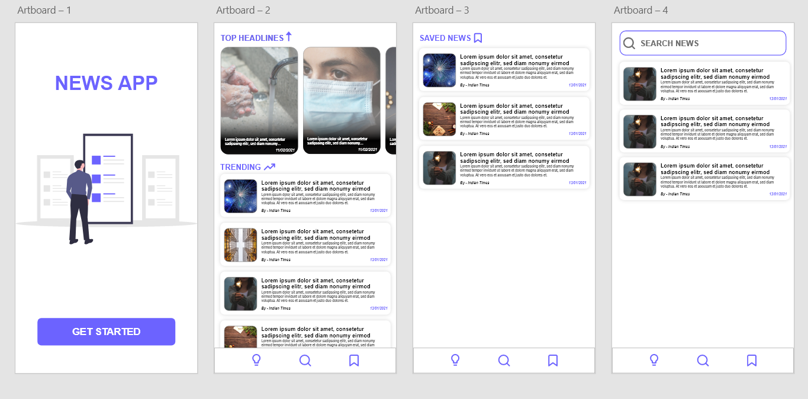
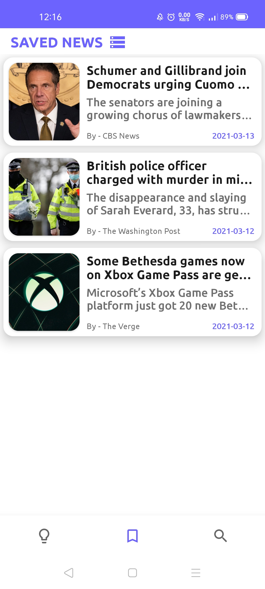

# Description 

- Application Name - ** KOTLIN NEWS APP**
- Architecture Used - MVVM
- Language Used - Kotlin (v1.3.72)  
- IDE used - Android Studio (v4.1.2)  
- Database Used - ROOM Database 
- API used - [newsapi.org](https://newsapi.org/)

# Components

- Material Design
- ROOM Database
- Retrofit2
- Kotlin Coroutines
- Navigation Components

# AdobeXD Design

 

# Screenshots

 | Home Screen | Top News | Search News | Saved News |
 --------------|------------|-------------|-----------|
 |  |   |  | 
 
 # Getting Started
 
 1. Clone/Download Project
 2. Get your [API KEY](https://newsapi.org/)
 3. Add Constanst.kt class -> Add Your API KEY

```
class Constants {
    companion object {
        const val API_KEY = "API KEY"
        const val BASE_URL = "https://newsapi.org"
        const val SEARCH_NEWS_TIME_DELAY = 500L
        const val QUERY_PAGE_SIZE = 20
    }
}
```

# Dependencies

- [ViewModel](https://developer.android.com/jetpack/androidx/releases/lifecycle)
- [ROOM](https://developer.android.com/jetpack/androidx/releases/room)
- [Coroutines](https://developer.android.com/kotlin/coroutines)
- [Retrofit](https://square.github.io/retrofit/)
- [Glide](https://github.com/bumptech/glide)
- [Navigation Component](https://developer.android.com/jetpack/androidx/releases/navigation)
- [Scalable Size Unit](https://github.com/intuit/sdp)

